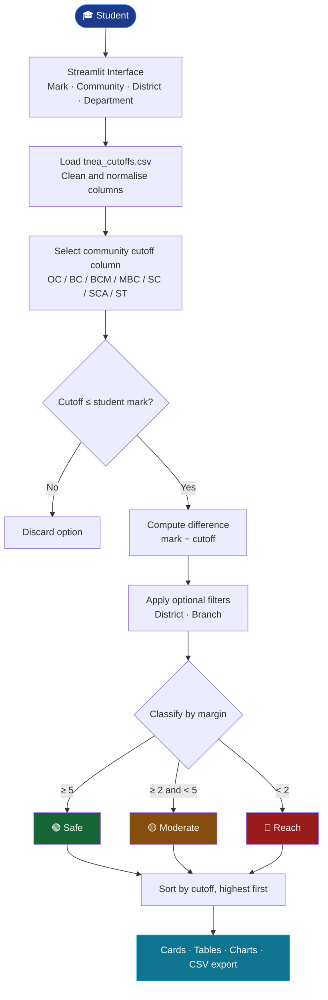
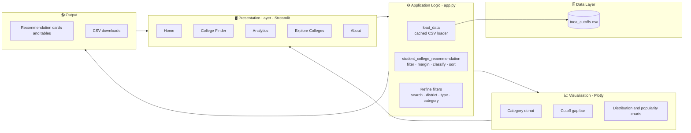

<div align="center">

# 🎓 TNEA College Allotment Intelligence
streamlit link:https://college-prediction-using-cutoff-marks-vbirdnlbtzqb24updyfwnk.streamlit.app/

**Turn your cutoff mark into a ranked, category-aware shortlist of Tamil Nadu engineering colleges.**

Enter your mark and community, and the system matches you against historical TNEA cutoffs, labels every option as **Safe**, **Moderate** or **Reach**, and lets you explore the results through interactive dashboards.

<br/>


[Overview](#-overview) · [How It Works](#-how-it-works) · [Features](#-key-features) · [Architecture](#-system-architecture) · [Installation](#-installation) · [Usage](#-usage) · [Roadmap](#-roadmap) · [Limitations](#-limitations)

</div>

---

## 📌 Overview

### The problem
Every year, thousands of students in Tamil Nadu face the TNEA counselling process with a single number, their cutoff mark, and a spreadsheet of thousands of college-branch combinations. Finding realistic options by hand means scanning across communities, districts, branches and college types, and it is easy to either aim too low or waste choices on options that are out of reach.

### The solution
**TNEA College Allotment Intelligence** is a data-driven recommendation app built on historical cutoff data. Given a student's cutoff mark and community, it:

1. Filters out every college-branch whose cutoff for that community is above the student's mark.
2. Computes the **margin** between the student's mark and each historical cutoff.
3. Classifies each option as 🟢 **Safe**, 🟡 **Moderate** or 🔴 **Reach**.
4. Presents the results as cards, tables and charts that can be refined and exported.

> ⚠️ This is an educational / portfolio project. It is **not** an official TNEA tool and does not guarantee admission. See [Limitations](#-limitations).

---

## 🧭 Project Snapshot

| | | |
|---|---|---|
| 📊 **Data-Driven** <br/> Built on historical TNEA cutoff data | 🎯 **Category-Aware** <br/> OC · BC · BCM · MBC · SC · SCA · ST | 🟢🟡🔴 **Risk Labelling** <br/> Safe / Moderate / Reach for every match |
| ⚡ **Interactive** <br/> Real-time filtering by district, branch, type | 📈 **Visual Analytics** <br/> Plotly dashboards for the whole dataset | ⬇️ **Exportable** <br/> Download any result set as CSV |

---

## ⚙️ How It Works



### Classification rules

| Category | Condition (`difference = your mark − cutoff`) | Meaning |
|:--|:--|:--|
| 🟢 **Safe** | `difference ≥ 5` | Your mark comfortably clears the historical cutoff |
| 🟡 **Moderate** | `2 ≤ difference < 5` | Likely, but with a smaller margin |
| 🔴 **Reach** | `difference < 2` | Close to the historical cutoff; treat as a stretch option |

Results are sorted by cutoff in descending order, so the most competitive options you still qualify for appear first.

---

## ✨ Key Features

### Implemented

| Feature | Description |
|:--|:--|
| 🎯 **College Finder** | Enter a cutoff mark (0–200) and community to get a ranked shortlist |
| 🏷️ **Safe / Moderate / Reach labels** | Every recommendation is tagged by its margin over the historical cutoff |
| 📍 **District & department filters** | Narrow results by preferred city and branch with partial, case-insensitive matching |
| 🔎 **In-result refinement** | Search by college / branch / district and filter by district, college type and category |
| 🧩 **Zero-result diagnostics** | When filters are too strict, the app shows how many matches exist if you relax district, department, or both, and lists broader alternatives |
| 📊 **Dashboards** | KPI cards, category distribution donut, and a cutoff-gap chart for the top match |
| 📈 **Dataset analytics** | Cutoff distribution by community, mean cutoff per category, college-type split, district and branch popularity |
| 📚 **Dataset explorer** | Browse, search and filter the full cutoff dataset |
| ⬇️ **CSV export** | Download recommendations or filtered dataset views |
| 🌙 **Custom dark UI** | Styled Streamlit interface with a multi-page sidebar navigation |

### Proposed

- [ ] Rank-based prediction in addition to cutoff marks
- [ ] Multi-year cutoff trends per college and branch
- [ ] Probability-style scoring instead of fixed margin thresholds
- [ ] Side-by-side college comparison
- [ ] Choice-list builder for counselling preparation
- [ ] Automated tests and CI

---

## 🏗️ System Architecture



| Layer | Responsibility |
|:--|:--|
| **Presentation** | Streamlit pages, sidebar preferences, custom CSS theme |
| **Application logic** | Data loading and cleaning, recommendation engine, result refinement |
| **Data** | `tnea_cutoffs.csv` with college, district, type, branch and per-community cutoffs |
| **Visualisation** | Plotly charts rendered inside the Streamlit pages |

---

## 🔬 Recommendation Pipeline

```
Student Input → Data Preparation → Eligibility Filter → Margin Computation → Risk Classification → Ranking → Presentation
```

| Stage | What happens |
|:--|:--|
| **1. Student input** | Cutoff mark, community, optional district and department, number of results to show |
| **2. Data preparation** | The CSV is loaded once and cached; column names are normalised, text columns trimmed, and cutoff columns converted to numeric (invalid values become `NaN`) |
| **3. Eligibility filter** | The community's cutoff column is selected; rows with a missing cutoff or a cutoff above the student's mark are dropped |
| **4. Margin computation** | `difference = student mark − historical cutoff` for every remaining row |
| **5. Risk classification** | Margin thresholds (5 and 2) assign Safe / Moderate / Reach |
| **6. Ranking** | Results are sorted by cutoff, descending |
| **7. Presentation** | Top matches as cards, full results as a table, charts for context, CSV for export |

### Notebook and serialized artifacts
The repository also contains `college allotement.ipynb` (the original exploration and logic), plus `model.pkl` and `scaler.pkl`. The Streamlit app's recommendation engine is rule-based and reads directly from `tnea_cutoffs.csv`.

---

## 🧰 Technology Stack

| Area | Technologies |
|:--|:--|
| **Frontend / UI** |  custom CSS, Inter font |
| **Backend / Logic** |  |
| **Data Processing** |   |
| **Visualisation** |  |
| **Data Storage** | CSV file (`tnea_cutoffs.csv`) |
| **Experimentation** |  |
| **Version Control** |   |

---

## 📁 Project Structure

```
COLLEGE-PREDICTION-USING-CUTOFF-MARKS/
├── app.py                      # Streamlit application (UI + recommendation logic)
├── college allotement.ipynb    # Notebook: data exploration and original logic
├── tnea_cutoffs.csv            # Historical cutoff dataset
├── model.pkl                   # Serialized model artifact
├── scaler.pkl                  # Serialized scaler artifact
├── .gitattributes
├── requirements.txt            # (recommended addition)
├── LICENSE                     # (recommended addition)
└── README.md
```

### Dataset schema (`tnea_cutoffs.csv`)

| Column | Description |
|:--|:--|
| `college_code`, `college_name` | College identifier and name |
| `district` | District where the college is located |
| `college_type` | Type / category of the college |
| `branch_code`, `branch_name` | Branch identifier and department name |
| `oc`, `bc`, `bcm`, `mbc`, `sc`, `sca`, `st` | Historical cutoff for each community (missing values are skipped) |

---

## 🚀 Installation

### Prerequisites
- Python 3.9 or newer
- `pip`
- Git

### 1. Clone the repository
```bash
git clone https://github.com/amohamedarsath68/COLLEGE-PREDICTION-USING-CUTOFF-MARKS.git
cd COLLEGE-PREDICTION-USING-CUTOFF-MARKS
```

### 2. Create a virtual environment
```bash
# macOS / Linux
python -m venv venv
source venv/bin/activate

# Windows
python -m venv venv
venv\Scripts\activate
```

### 3. Install dependencies
```bash
pip install -r requirements.txt
```
or install directly:
```bash
pip install streamlit pandas numpy plotly
```

### 4. Verify the dataset
`tnea_cutoffs.csv` must sit in the same folder as `app.py` (it is already included in this repository).

### 5. Configuration
No API keys, environment variables or database setup are required. The app is fully self-contained.

---

## ▶️ Usage

```bash
streamlit run app.py
```

Open the URL shown in your terminal (by default `http://localhost:8501`).

### Example workflow

1. Open **🎯 College Finder** from the sidebar.
2. Enter your **Cutoff Mark** (for example `185.5`).
3. Choose your **Community** (OC / BC / BCM / MBC / SC / SCA / ST).
4. Keep **District** and **Department** on *All* for a first pass.
5. Click **🔍 Find My Colleges**.
6. Refine using search, district, college type and category filters.
7. Download the shortlist as CSV.

### Sample output

| College | District | Department | Cutoff | Student Mark | Difference | Category |
|:--|:--|:--|--:|--:|--:|:--|
| *College A* | *District X* | *Computer Science and Engineering* | 180.25 | 185.50 | +5.25 | 🟢 Safe |
| *College B* | *District Y* | *Information Technology* | 182.75 | 185.50 | +2.75 | 🟡 Moderate |
| *College C* | *District Z* | *Electronics and Communication* | 184.50 | 185.50 | +1.00 | 🔴 Reach |

> Illustrative values only. Real output depends on the dataset.

### Screenshots
<!-- Add screenshots to an /assets folder and uncomment the lines below -->
<!--
<p align="center">
  
  
</p>
-->

---

## 🗺️ Roadmap

- [ ] Add `requirements.txt` and pin dependency versions
- [ ] Rank-based predictions alongside mark-based ones
- [ ] Multi-year cutoff trend analysis
- [ ] Probability-based admission likelihood
- [ ] College comparison view
- [ ] Choice-list builder for counselling rounds
- [ ] Unit tests for the recommendation function
- [ ] Deployment on Streamlit Community Cloud

---

## ⚠️ Limitations

- **Historical data only.** Recommendations reflect past cutoffs; actual cutoffs change every year.
- **Not an official tool.** Final allotment is decided by TNEA counselling rules, seat availability, rank and round-wise allocation.
- **Fixed thresholds.** The Safe / Moderate / Reach boundaries (5 and 2 marks) are heuristics, not statistically derived probabilities.
- **Single-snapshot dataset.** The app does not compare cutoffs across multiple years or counselling rounds.
- **Data quality dependent.** Missing or inconsistent entries in the CSV are skipped or may affect results.

---

## 🤝 Contributing

Contributions, issues and feature ideas are welcome.

1. Fork the repository
2. Create a feature branch: `git checkout -b feature/your-feature`
3. Commit your changes: `git commit -m "Add your feature"`
4. Push the branch: `git push origin feature/your-feature`
5. Open a Pull Request

---

**If this project helped you, consider giving it a ⭐**

*Built with Python · Pandas · Streamlit · Plotly*

</div>
